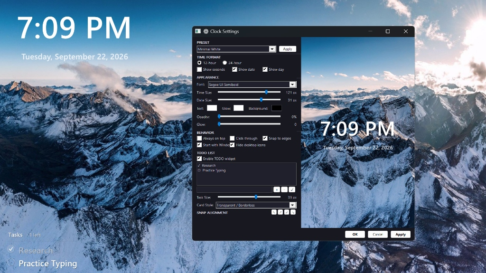
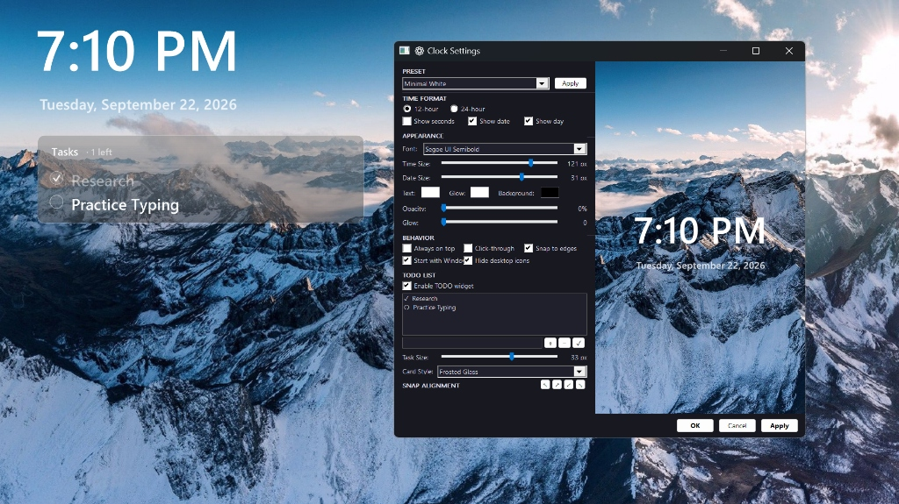

# FClockOn (Windows Clock Widget)






A beautiful, highly customizable, and lightweight open-source desktop clock and widget for Windows, built with C++ and GDI+.

## Features
- **Integrated To-Do Widget**: Built-in minimalist desktop task manager with interactive completion checkboxes, task counters, and editable task lists.
- **Frosted Glass & Borderless Styles**: Choose between a modern translucent frosted glass card or a clean borderless transparent aesthetic.
- **Highly Customizable**: Change fonts, sizes, text color, glow color, and background opacity.
- **Dynamic Snap Alignment**: Drag to the edges of your screen or use the quick-align arrows in the settings to snap the clock perfectly to the corners.
- **Live Preview Settings**: A two-pane settings dialog with a real-time preview canvas that shows your active wallpaper.
- **Hide Desktop Icons**: Includes a seamless built-in toggle to instantly hide and restore your Windows desktop icons for a clean aesthetic.
- **Presets**: Comes with beautiful built-in themes like *Minimal White*, *Forest Glass*, *Cyberpunk*, *Ocean Blue*, and *Vintage Warm*.
- **Always on Top & Click-Through**: Fully supports standard widget behaviors so it never gets in your way.
- **Ultra Lightweight**: A standalone portable executable (~600 KB) with minimal CPU and RAM usage.

## How to Run
1. Download `FClockOn.exe` from the latest release (or build it yourself).
2. Double-click the executable to run it.
3. The clock will appear on your desktop. A tray icon will also appear in your taskbar.
4. **Double-click the clock** or right-click the tray icon and select **Settings** to customize it.

## Building from Source

This project uses LLVM MinGW and PowerShell for building to ensure a lightweight footprint without the overhead of heavy MSVC runtimes.

### Requirements
- **LLVM MinGW**: Ensure `clang++` and `lld` are in your system PATH.
- **PowerShell**: To run the build script.

### Build Instructions
1. Clone the repository:
   ```cmd
   git clone https://github.com/axusmotion/fclockon.git
   cd fclockon
   ```
2. Run the build script in PowerShell:
   ```powershell
   .\build.ps1
   ```
3. The compiled `FClockOn.exe` will be generated in the root directory.

## License
This project is licensed under the MIT License - see the [LICENSE](LICENSE) file for details.
